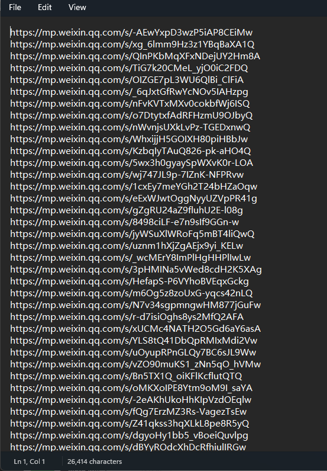
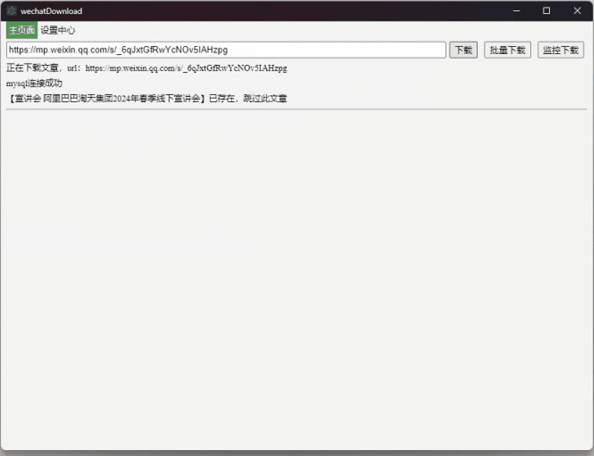
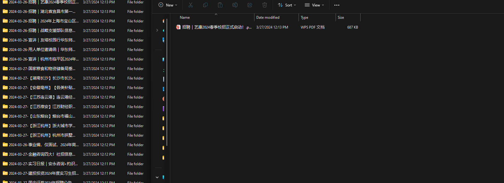
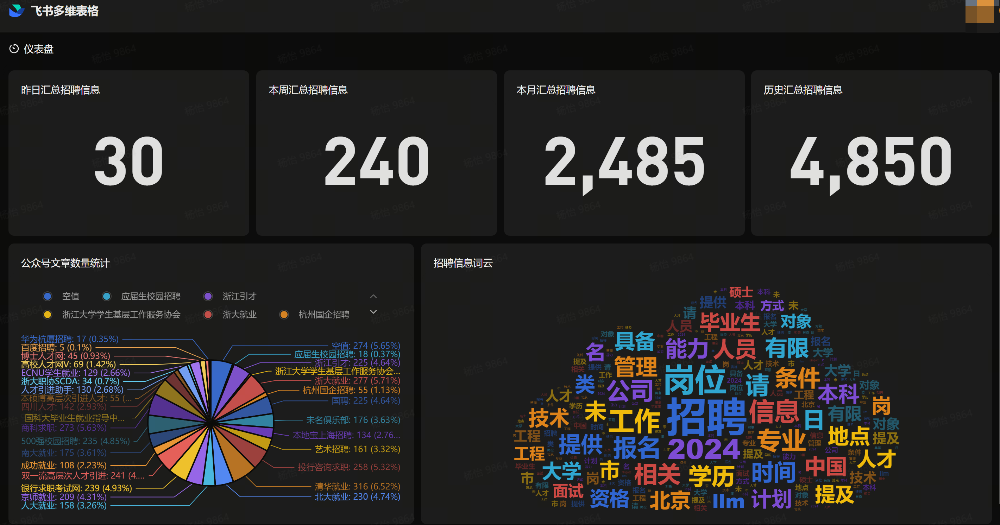

# Pandora WeChat Article Collector and Summarizer

Automatically collect and summarize articles from WeChat Official Accounts.

## Features

- Batch collection of WeChat article links using Quicker
- Article downloading using [wechatDownload](https://github.com/xiaoguyu/wechatDownload)
- Article summarization using Large Language Models (LLM)
- Automatic upload of summaries to Feishu (Lark) documents and Airtable

## How It Works

### 1. Collecting Article Links with Quicker

We use Quicker to simulate mouse and keyboard operations for batch collection of article links.

- Quicker action: [Get WeChat Official Account Article Links](https://getquicker.net/Sharedaction?code=804e8748-a95d-43bd-402d-08dc41766143)

Output:

Note: Currently optimized for 2560×1440 screens. Other resolutions may require adjustments.

### 2. Downloading Articles

We use the open-source project [wechatDownload](https://github.com/xiaoguyu/wechatDownload) to download the articles.

### 3. Summarizing Articles

Articles are summarized using Large Language Models.

### 4. Uploading Summaries

Summaries are automatically uploaded to Feishu (Lark) documents and Airtable for easy access and organization.

## Complete Workflow

Full Quicker action: [Automatic WeChat Article Collection and Summarization](https://getquicker.net/Sharedaction?code=a5ed830b-e2fa-444a-402e-08dc41766143)

Output:

Set this to run daily for automated WeChat Official Account monitoring and collection (RSS-like functionality).

## Use Case

[Pandora Job Information Sharing](https://jobs.daydreammy.xyz)

As of 2024-03-28:

## Future Improvements

- Refactor and optimize code
- Improve Quicker action to be more adaptable to different screen resolutions
- Enhance PDF summary operations and database integration
- Integrate with larger RSS projects
- Expand to more diverse information sources (news sites, podcasts, blogs, Bilibili videos, etc.)

## Vision

Our ultimate goal is to facilitate smoother information flow and provide an AI assistant to help process information overload:

1. Summarize content from various sources to create a personalized RSS-like experience
2. Allow users to stay informed while spending less time on information consumption

## Notes

- This project demonstrates that sometimes the most effective anti-crawling measures are the simplest, human-like approaches
- The quality of input data significantly shapes the model's (and human's) potential
- We aim to make information more accessible and manageable in our increasingly data-rich world

